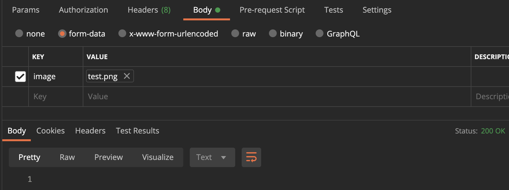

# 유저 프로필 이미지 수정/삭제하기

## METHOD

```http
PATCH
```

## URL

```http
/users/:id/image
```

* id: 유저 정보를 수정할 유저의 픽미업 DB에서의 고유 id

## REQUEST BODY
|name|type|require|description
|---|---|---|---|
|image|multipart/form-data|필수(empty일 경우 삭제됨)|사용자 프로필 이미지|
> 현재 저장가능한 이미지로 `.jpg`, `.jpeg`, `.gif`, `.png`, `.img`, `.tiff`, `.heif` 확장자만 지원합니다.  
> `image`로 아무 값도 전달하지 않을 경우 유저 프로필 이미지를 삭제하는 것으로 간주합니다. 

### REQUEST BODY EXAMPLE



## RESPONSE
### success
#### 프로필 이미지 수정
**HTTP Status code : 201 Created**
> Response Body는 따로 없습니다.  
> 대신, Http Location **헤더**에 생성된 자원의 경로를 붙여서 반환합니다.  
> 또한, 유저 정보 불러오기 API를 다시 한 번 호출하면, 바뀐 이미지 경로를 확인할 수 있습니다.

#### 프로필 이미지 삭제
**HTTP Status code : 204 No Content**
> Response Body는 따로 없습니다.  

### fail
**HTTP Status code : 400 Bad Request or 500 Internal Server Error**

```json
{
    "status": 400,
    "message": "지원하지 않는 파일 형식입니다. "
}
```

```json
{
    "status": 500,
    "message": "파일 변환에 실패했습니다. "
}
```

|name|type|description|
|---|---|---|
|status|number|HTTP status code(에러 상황에 따라 변할 수 있습니다. )|
|message|string|에러 메시지(메시지 내용은 에러 상황에 따라 변할 수 있습니다. )|
